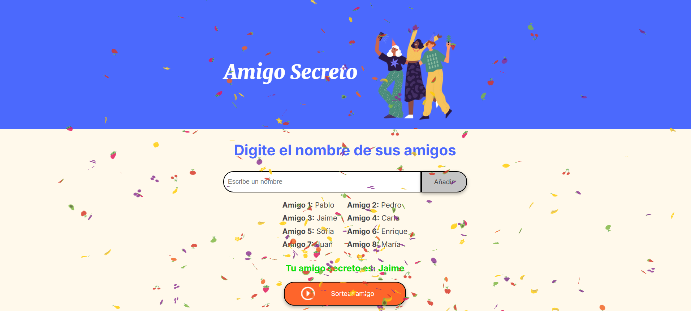

# 🎁 Amigo Secreto

**Amigo Secreto** es una aplicación web sencilla que permite agregar amigos a una lista y realizar un sorteo aleatorio para elegir un amigo secreto.  

---

## 🚀 **Cómo jugar**
1. **Escribe los nombres de los participantes** en el campo de entrada.
2. **Presiona "Añadir"** para agregarlos a la lista.
3. **Haz clic en "Sortear amigo"** para elegir un ganador al azar.
4. **Disfruta del efecto de confeti al conocer al amigo secreto! 🎉**

---

## 🛠️ **Tecnologías utilizadas**
- HTML5
- CSS3
- JavaScript

---

## 📌 **Vista previa**

---

🎁 **¡Diviértete con tu sorteo de Amigo Secreto!**  
